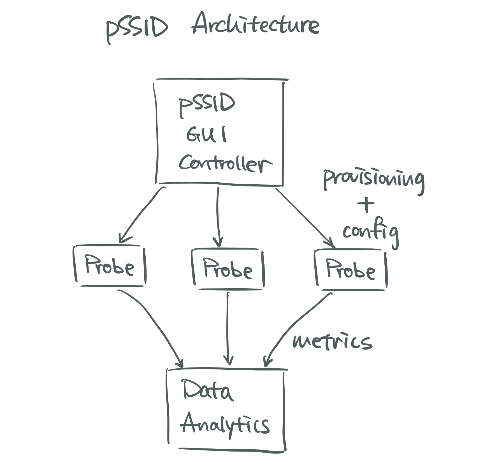

# pSSID Documentation v0.1

### Intro
The entire pSSID system consists of three major components, a frontend GUI controller,
a scalable collection of Raspberry Pi WiFi probes, and a data analytics pipeline.

</img>

The high level workflow is as follows. Users interact with the frontend controller
to define available probes and tasks to run. Then the list of tasks will be copied
onto the defined probes as config files and initiate pSSID daemon. After the
daemon finishes a task, output metrics will be forwarded to the data server for
storage and visualization.

### pSSID GUI Dashboard
Source project: https://github.com/UMNET-perfSONAR/pssid-gui2

Deployment scripts:
https://github.com/UMNET-perfSONAR/ansible-playbook-pssid-GUI-deploy

(For developers) build and publish scripts:
https://github.com/UMNET-perfSONAR/ansible-playbook-pssid-GUI-build-publish

### pSSID Daemon
The GUI Deployment scripts will install the following playbook and corresponding roles on the GUI server. Or, user can manually setting it up by clone the roles under provisioning playbook's roles folder.

Source project: https://github.com/UMNET-perfSONAR/pssid-daemon/blob/main/pssid-daemon.py

Provisioning playbook
https://github.com/UMNET-perfSONAR/ansible-playbook-pssid-daemon

Associated roles
https://github.com/UMNET-perfSONAR/ansible-role-pssid-daemon
https://github.com/UMNET-perfSONAR/ansible-role-pssid-VT-tools

### pSSID Data Analytics
https://github.com/UMNET-perfSONAR/pssid-data-pipeline
